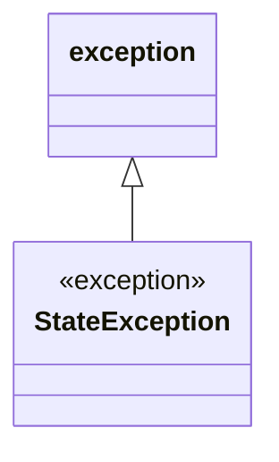

# CPP TP2 Nathan Eugénie

## Build et Compilation

```bash
mkdir build
```
```bash
cmake -Bbuild .
```
```bash
cmake --build build/
```
```bash
./build/CPP_TP2_EUGE_NATH
```

## Class Diagram

Le diagramme de classes est fait avec mermaid.
> https://mermaid.js.org/syntax/classDiagram.html



## StateException

Lorsqu'un véhicule est dans un état qui ne permet pas de faire certaines actions, on utilise la classe d'exception `StateException`.  
Cette classe hérite de `std::exception`.  
Quand on effectue une action avec un véhicule, s'il n'est pas dans un bon état, on peut le savoir plus précisément, au lieu de `catch` un *string*.

## 3

Comme faire en sorte que les attributs de Vehicule ne soient pas dupliqués si nécessaire ?  

> Si l'on veut que ne soit pas dupliquer, il faudrait que `Vehicule` et `Bateau` hérite de `Vehicule` en *virtual*.  
